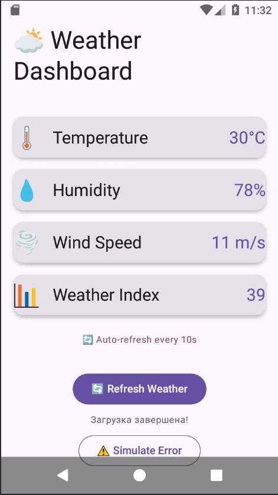
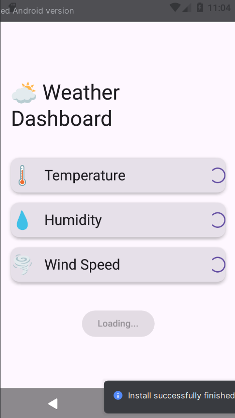
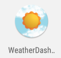

# Лабораторная работа №17-18. Корутины на практике: Метеосводка

ФИО: Федотова В.С.

Группа: ИСП-232

Дата: 30.03.26

---

## Описание

Weather Dashboard - это приложение для Android, демонстрирующее работу корутин в Kotlin.
Оно имитирует загрузку данных о погоде из разных источников, показывает индикаторы загрузки, обрабатывает ошибки и обновляет UI без блокировки основного потока.

## Функциональность

- Отображение температуры, влажности, скорости ветра и индекса погоды
- Параллельная загрузка данных
- Кнопка ручного обновления
- Автоматическое обновление каждые 10 секунд
- Симуляция ошибки сервера для тестирования обработки исключений
- Текстовый индикатор прогресса загрузки

## Технологии и библиотеки

- Kotlin
- Jetpack Compose
- Material Design 3
- Coroutines
- ViewModel
- StateFlow

## Контрольные вопросы

### В чём разница между launch и async?

Launch - запускает корутину не возвращая результат. Async возвращает результат.

- Когда использовать каждый из них?: Launch - когда нужно просто выполнить задачу; async - когда нужно вернуть результат

- Приведите пример кода: 
``` kotlin
// launch
viewModelScope.launch {
loadData()
}

// async
val result = viewModelScope.async {
calculateSomething()
}.await()
```

### Что такое suspend функция?

Suspend функция - это функция которую можно приостановить, при этом не блокируя поток

- Может ли она вызываться из обычной функции?: Suspend функция может быть вызвана только из другой suspend-функции или из корутины.

- Почему delay() не блокирует поток?: delay приостанавливает только текущую корутину, но поток остаётся свободным для выполнения других задач.

### Зачем нужны разные диспетчеры?

Диспетчеры определяют, на каком потоке или пуле потоков будет выполняться корутина. Это позволяет распределять нагрузку и не блокировать UI.

- Приведите таблицу с 3 диспетчерами и примерами задач:

| Dispatcher | Когда использовать  |              Пример              |
|:----------:|:-------------------:|:--------------------------------:|
|    Main    |    Обновление UI    |     Изменить текст в Text()      |
|     IO     | Чтение/запсь данных |  Загрузка картинки из интернета  |
|  Default   |     Вычисления      | Обработка 10000 элементов списка |

- Что будет, если выполнить тяжёлое вычисление на Dispatchers.Main?: Приложение зависнет

### Что произойдёт, если не обработать исключение в корутине?

Если исключение не обработать внутри корутины, оно всплывает вверх по иерархии.

- Как корректно обрабатывать ошибки?: Использовать try-catch внутри корутины или в месте вызова await().

- Зачем нужен try-catch внутри launch?: Чтобы перехватить исключение и обработать его, не допуская краша приложения.

### Как работает автоматическая отмена корутин?

- Что такое viewModelScope?: Это встроенная область видимости корутин, привязанная к жизненному циклу ViewModel.

- Когда корутины отменяются автоматически?: 
  - При уничтожении ViewModel (например, при закрытии экрана или повороте устройства)
  - При отмене родительской корутины 
  - При возникновении исключения в родительской корутине

## Как запустить проект

1. Открыть репозиторий GitHub https://github.com/vfedotova418-png/WeatherDashboard_Fedotova
2. Скачать zip архив проекта
3. Распаковать
4. Запустить на эмуляторе/подключённом устройстве

## Скриншоты




